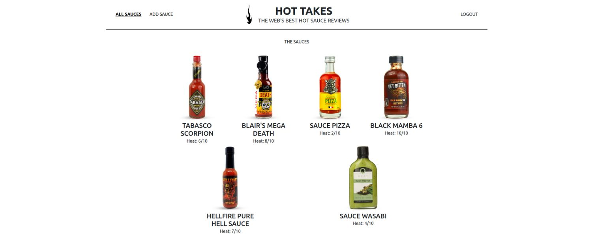

# Piiquante 🌶 : Application web sécurisée 

> 🖥️ **API REST de notation de sauces sécurisée avec Node.js et le framework Express en utilisant une base de données MongoDB !**

## 🎯 Objectif

_Développer le Back-end d'une application web de critique de sauces piquantes._

## ⚛️ Technologies
&nbsp;&nbsp;&nbsp;&nbsp;

## 🧞 Commandes

Toutes les commandes sont exécutées depuis la racine du projet, à partir d'un terminal :

| Command                   | Action                                           |
| :------------------------ | :----------------------------------------------- |
| `nodemon server`          | Démarre le serveur local du Front-end            |
| `npm run ng serve`        | Démarre le serveur local du Back-end             |

